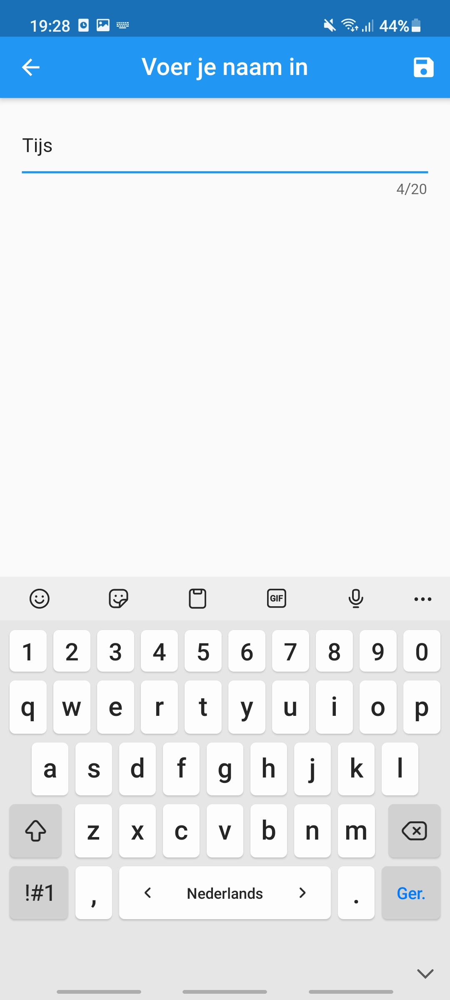
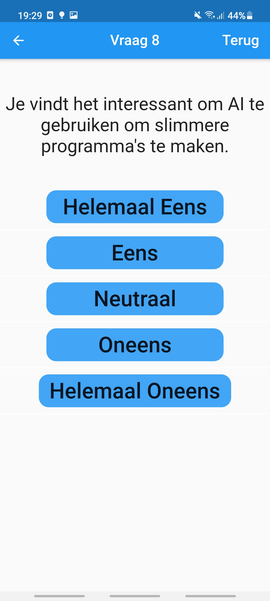

# SorteerHoed Informatica Leiden

Mobiele applicatie gemaakt met Flutter.

In de eerste periode van het eerste jaar moesten we een python programma maken die je in de console kon gebruiken. 
Het programma moest een vragenlijst zijn waarmee je de gebruiker kan indelen op in 1 van de 4 specialisaties die je moet kiezen aan het einde van het jaar.

In de vakantie ben ik gaan werken aan de grafische mobiele versie van dit project als persoonlijk project.
|||

De vragenlijst bestaat uit 20 vragen over de vier verschillende specialisaties.
Aan het einde wordt er een grafiek getoont met percentage dat je interesse overlapt met de specialisatie. 
De antwoorden worden opgeslagen in SQFLite database, en kunnen opnieuw worden ingezien.

|||
