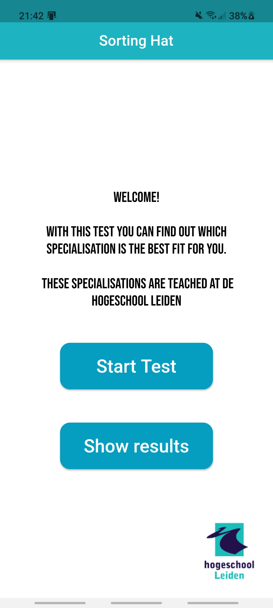

# SorteerHoed Informatica Leiden

Mobiele applicatie gemaakt met Flutter.

In de eerste periode van het eerste jaar moesten we een python programma maken die je in de console kon gebruiken. 
Het programma moest een vragenlijst zijn waarmee je de gebruiker kan indelen op in 1 van de 4 specialisaties die je moet kiezen aan het einde van het jaar.

In de eerste periode van jaar 2 heb ik een keuzevak Frameworks gekozen waarbij je zelf mag beslissen welke framework je wilt leren.
Ik had Flutter gekozen, dit is mijn project voor het vak.

De vragenlijst bestaat uit 20 vragen over de vier verschillende specialisaties.
Aan het einde van de test wordt er gevraagt of je je resulaat online wilt delen. 
Daarnawordt er een grafiek getoont met percentages per specialisatie.
De antwoorden worden opgeslagen in een SQFLite database of in een Firebase FireStore database, en kunnen later opnieuw worden ingezien.

